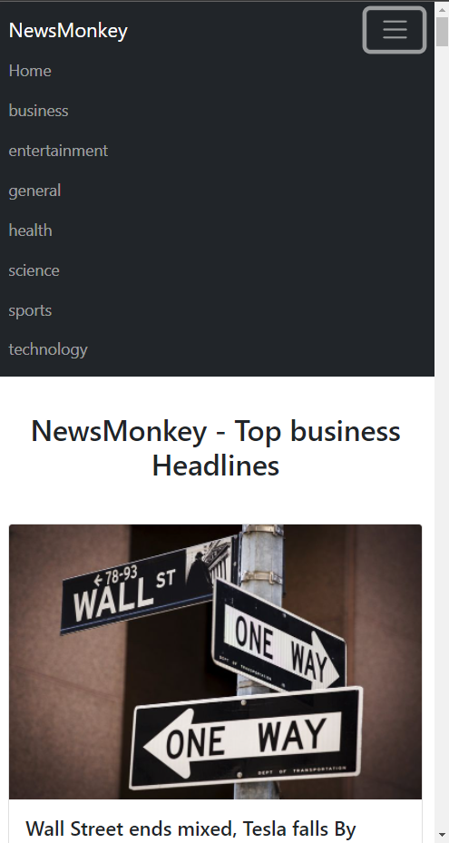

# TextUtils

This app can do basic text manipulation like capitalizing text, copying to clipboard etc & it has dark mode functionality. This project's purpose was to understand JSX components and how to use them.

## Screenshots

## Tech Stack

**Client:** React, Bootstrap.

